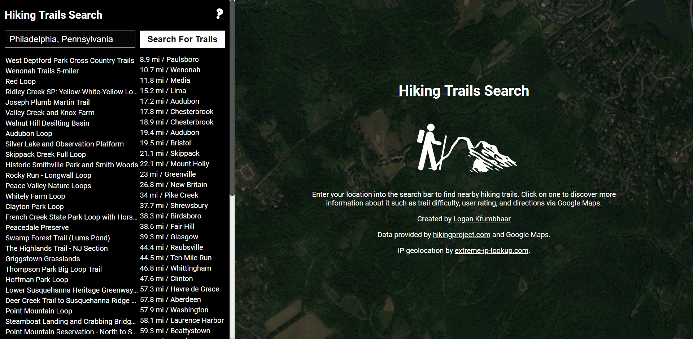
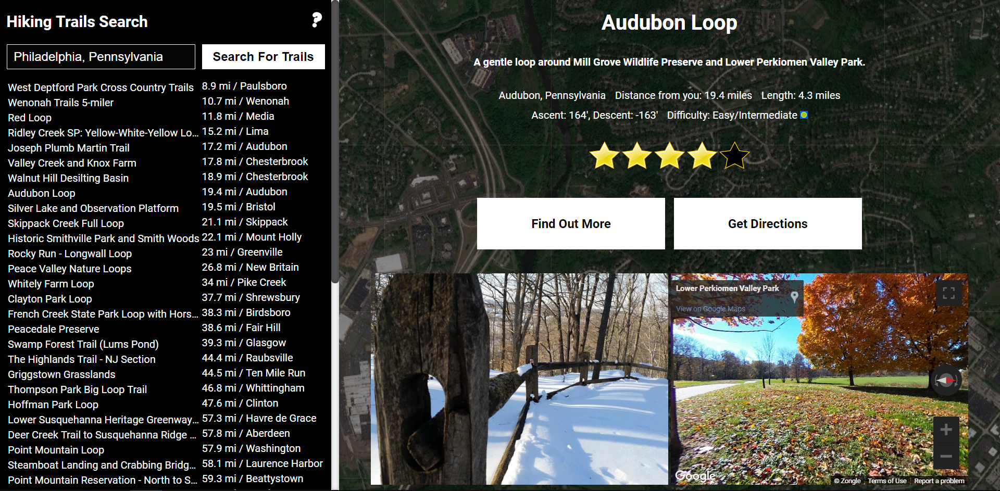

# Hiking Trails Search

Tool to find nearby hiking trails and get more information on them. First, type in your location and click search to bring up a list of nearby trails sorted by their proximity to you. Next, you can click on one to view information about it such as difficulty and length or get directions to it.

## Demo:

https://krogank9.github.io/hiking-trails-search/

## Screenshots:

## Built With:

* Javascript/jQuery/HTML5/CSS
* Google Maps API
* hikingproject.com API
* extreme-ip-lookup.com API
